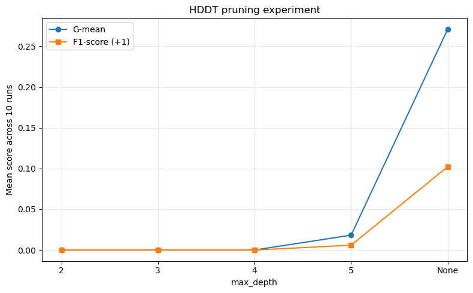
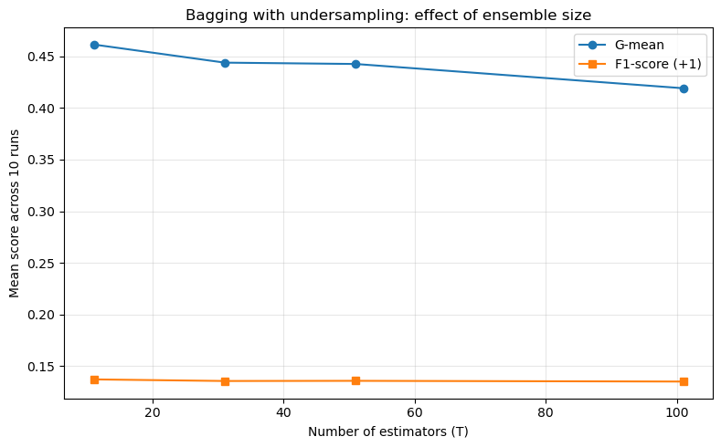
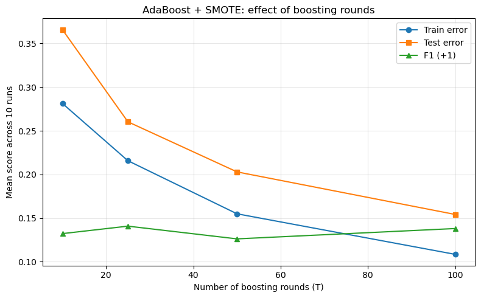

# COVID-19 Severity Prediction with Imbalanced Ensemble Learning

## Overview

This project investigates machine learning approaches for predicting severe COVID-19 cases from clinical and demographic data under strong class imbalance.

The main challenge is that severe cases represent only a small fraction of the available observations. Because of this imbalance, conventional accuracy alone is not sufficient for evaluating model performance.

The project focuses on three imbalance-aware learning approaches:

- Hellinger Distance Decision Tree (HDDT)
- Bagging with majority-class undersampling
- AdaBoost.M1 with SMOTE

The experiments compare how these methods affect the detection of severe cases, with particular attention to minority-class recall, F1-score, AUC-ROC, and G-mean.


# Dataset

The project uses the `Covid.csv` dataset.

The dataset contains:

| Property | Value |
| --- | ---: |
| Samples | 1,585 |
| Input features | 40 |
| Target column | `Label` |
| Severe cases (`+1`) | 100 |
| Non-severe cases (`-1`) | 1,485 |
| Approximate imbalance ratio | 15:1 |

The prediction task is binary classification:

- `+1` represents severe cases
- `-1` represents non-severe cases


## Feature Groups

The dataset contains several categories of patient information.

### Demographic Features

Examples include:

- Age
- Gender

### Symptoms

Examples include:

- Fever
- Cough
- Muscular pain
- Shortness of breath
- Loss of smell
- Loss of taste
- Headache
- Dizziness
- Nausea
- Vomiting
- Diarrhea

### Comorbidities

Examples include:

- Diabetes
- Cancer
- Heart disease
- Chronic kidney disease
- Asthma
- HIV/AIDS
- Chronic liver disease
- Chronic blood diseases
- Hypertension

### Clinical Indicators

Examples include:

- Intubation
- PO2
- Contact with a patient


# Class Imbalance

The dataset is highly imbalanced.

```text
Non-severe (-1): 1485
Severe (+1):      100
```

This means that a classifier can achieve high overall accuracy simply by favoring the majority class.

For this reason, the experiments emphasize metrics that better reflect minority-class performance rather than relying only on accuracy.


# Missing Data Analysis

Several features contain missing observations.

Some of the largest documented missing-value rates are:

| Feature | Missing Rate |
| --- | ---: |
| `headache` | 82.08% |
| `dizziness` | 82.08% |
| `paresis` | 82.08% |
| `plexus` | 82.08% |
| `Chest pain` | 82.08% |
| `inflammation / skin lesions` | 82.08% |
| `Stomachache` | 64.54% |
| `nausea` | 64.54% |
| `vomiting` | 64.54% |
| `diarrhea` | 64.54% |
| `loss of appetite` | 64.54% |
| `loss of taste` | 1.70% |
| `Convulsions` | 1.70% |

Missing values are handled using statistics learned only from the training data in order to avoid data leakage.


# Preprocessing Pipeline

The preprocessing procedure is performed independently for each train/test split.

The main steps are:

1. Load `Covid.csv`
2. Perform a stratified train/test split
3. Fit missing-value imputers using the training set
4. Impute missing observations
5. Analyze feature correlation
6. Remove strongly redundant features
7. Scale continuous features when necessary
8. Train the selected classifier
9. Evaluate predictions on the held-out test set


## Train/Test Split

A stratified split is used:

- 70% training
- 30% testing

Stratification helps preserve the minority/majority class distribution in both subsets.


## Missing-Value Imputation

Two strategies are used depending on feature type:

- Median imputation for numerical features
- Most-frequent imputation for categorical or binary features

All imputation parameters are estimated using only the training data.


# Feature Selection

Kendall rank correlation is used to identify strongly related feature pairs.

For pairs satisfying:

`|tau| > 0.5`

one of the two features is removed.

The feature having the stronger absolute relationship with the target is retained.

In the documented preprocessing run using `random_state=42`, the feature:

`vomiting`

is removed, leaving 39 features.


# Evaluation Strategy

The experiments are repeated across 10 random seeds:

```text
0, 1, 2, 3, 4, 5, 6, 7, 8, 9
```

The final results are reported using the mean and standard deviation across these runs.

Because of the severe class imbalance, multiple evaluation metrics are considered.


## Accuracy

Accuracy measures the proportion of correctly classified observations.

However, it can be misleading for highly imbalanced datasets.


## Precision

Minority-class precision measures how many samples predicted as severe are actually severe.


## Recall

Minority-class recall measures how many actual severe cases are successfully detected.

For this application, recall is particularly important because failing to identify severe cases is a major classification error.


## F1-Score

F1 combines minority-class precision and recall:

`F1 = 2 * (Precision * Recall) / (Precision + Recall)`


## AUC-ROC

AUC-ROC evaluates how well the model separates the two classes across different classification thresholds.


## G-Mean

G-mean considers performance on both classes and is useful for imbalanced classification.

Conceptually:

`G-mean = sqrt(Sensitivity * Specificity)`


# Task 1: Hellinger Distance Decision Tree

## Overview

The first model is a Hellinger Distance Decision Tree implemented from scratch.

Traditional decision-tree impurity criteria may be strongly affected by class distributions.

Hellinger distance provides an alternative splitting criterion designed to be less sensitive to changes in class priors.


## HDDT Implementation

The custom implementation includes:

- Recursive tree construction
- Custom tree nodes
- Threshold search
- Hellinger-based split evaluation
- Maximum-depth control
- Minimum-sample stopping
- Majority-class leaf prediction
- Positive-class probability estimation


## Stopping Conditions

Tree construction stops when one of the following conditions is satisfied:

- The node contains too few observations
- All observations belong to one class
- Maximum tree depth is reached
- No useful split can be found


## HDDT Results

The default HDDT configuration produced the following average results over 10 runs:

| Metric | Mean | Standard Deviation |
| --- | ---: | ---: |
| Accuracy | 0.9109 | 0.0138 |
| Precision (+1) | 0.1562 | 0.0945 |
| Recall (+1) | 0.0833 | 0.0503 |
| F1-score (+1) | 0.1023 | 0.0564 |
| AUC-ROC | 0.5846 | 0.0186 |
| G-mean | 0.2710 | 0.0868 |

Despite relatively high accuracy, minority-class recall remains low.

This demonstrates why accuracy alone is not a reliable evaluation metric for this dataset.


## HDDT Pruning Experiment

Different tree depths were also investigated.



Shallow trees can maintain high overall accuracy while performing poorly on severe cases.

Among the tested HDDT configurations, the unpruned tree provided the strongest G-mean and F1 performance.


# Task 2: Bagging with Undersampling

## Overview

The second approach combines bagging with majority-class undersampling.

For every ensemble member:

1. Minority-class samples are bootstrapped
2. Majority-class observations are randomly undersampled
3. A balanced training subset is created
4. A base classifier is trained
5. Predictions from all classifiers are combined


## Ensemble Sizes

The following ensemble sizes are evaluated:

```text
T = 11, 31, 51, 101
```


## Bagging Results

The results using HDDT as the base learner are:

| T | Accuracy | Precision (+1) | Recall (+1) | F1 (+1) | AUC-ROC | G-mean |
| ---: | ---: | ---: | ---: | ---: | ---: | ---: |
| 11 | 0.3250 | 0.0751 | 0.8400 | 0.1371 | 0.6371 | 0.4615 |
| 31 | 0.2819 | 0.0735 | 0.8867 | 0.1355 | 0.6454 | 0.4439 |
| 51 | 0.2708 | 0.0734 | 0.9033 | 0.1357 | 0.6492 | 0.4426 |
| 101 | 0.2555 | 0.0730 | 0.9167 | 0.1350 | 0.6560 | 0.4191 |

Increasing the ensemble size generally increases severe-case recall.

However, this comes with a considerable reduction in overall accuracy.

This illustrates the trade-off between majority-class performance and minority-class detection.


## Ensemble Size Analysis



Among the tested HDDT bagging configurations, `T=11` achieved the strongest G-mean.


# Base Learner Comparison

The bagging framework is also evaluated using two different base learners:

- Custom HDDT
- Standard Decision Tree

The comparison is:

| Base Learner | Accuracy | Precision (+1) | Recall (+1) | F1 (+1) | AUC-ROC | G-mean |
| --- | ---: | ---: | ---: | ---: | ---: | ---: |
| Standard Decision Tree | 0.5345 | 0.0845 | 0.6233 | 0.1474 | 0.6398 | 0.5501 |
| Custom HDDT | 0.2708 | 0.0734 | 0.9033 | 0.1357 | 0.6492 | 0.4426 |

The HDDT-based ensemble produces substantially higher minority recall.

The standard decision-tree ensemble provides a better balance between the two classes and achieves higher F1 and G-mean in the documented comparison.


# Task 3: AdaBoost.M1 with SMOTE

## AdaBoost

The third experiment implements AdaBoost.M1.

AdaBoost trains a sequence of weak classifiers while progressively increasing the importance of incorrectly classified observations.

The implementation includes:

- Manual sample-weight updates
- Decision stumps as weak learners
- Weighted weak-classifier combination
- Multiple boosting rounds


## SMOTE

Because standard AdaBoost can remain strongly biased toward the majority class, SMOTE is investigated as an oversampling strategy.

Synthetic minority samples are generated by interpolating between nearby minority-class observations.

The project includes a custom implementation of the SMOTE procedure.


## Boosting Rounds

The following numbers of boosting rounds are evaluated:

```text
T = 10, 25, 50, 100
```


## AdaBoost Results

The comparison between AdaBoost with and without SMOTE is:

| Method | Accuracy | Precision (+1) | Recall (+1) | F1 (+1) | AUC-ROC | G-mean |
| --- | ---: | ---: | ---: | ---: | ---: | ---: |
| AdaBoost without SMOTE | 0.9368 | 0.0000 | 0.0000 | 0.0000 | 0.6113 | 0.0000 |
| AdaBoost + SMOTE | 0.7971 | 0.0888 | 0.2400 | 0.1263 | 0.5811 | 0.4343 |

The results reveal an important issue.

Standard AdaBoost achieves approximately 94% accuracy while completely failing to detect severe cases in the documented experiment.

Its minority-class recall and F1-score are both zero.

After applying SMOTE, overall accuracy decreases, but the model begins detecting severe observations.


## Boosting Round Analysis



Among the tested SMOTE configurations, `T=25` produced the strongest documented minority-class F1 performance.


# Final Model Comparison

The main methods can be compared using imbalance-aware metrics.

| Method | Configuration | F1 (+1) | G-mean | AUC-ROC |
| --- | --- | ---: | ---: | ---: |
| Bagging + Decision Tree | `T=51, max_depth=3` | 0.1474 | 0.5501 | 0.6398 |
| AdaBoost + SMOTE | `T=25` | 0.1408 | 0.5025 | 0.5837 |
| Bagging + HDDT | `T=11, max_depth=3` | 0.1371 | 0.4615 | 0.6371 |
| HDDT | `max_depth=None` | 0.1023 | 0.2710 | 0.5846 |
| AdaBoost | `T=10` | 0.0000 | 0.0000 | 0.5483 |


# Key Findings

The experiments demonstrate several important characteristics of imbalanced classification.

### Accuracy can be misleading

Standard AdaBoost achieves very high accuracy while detecting none of the severe cases.

This occurs because the majority class dominates the dataset.


### Resampling changes the learning objective

Both undersampling and SMOTE improve the model's ability to identify minority-class observations.

However, this improvement can reduce majority-class performance and therefore lower overall accuracy.


### High recall does not necessarily mean better overall balance

Bagging with HDDT reaches very high severe-case recall, but precision remains low.

Therefore, metrics such as F1-score and G-mean are needed to evaluate the trade-off.


### Base learner selection matters

In the documented bagging experiments, the standard decision tree provides a stronger balance between minority and majority performance than HDDT according to F1 and G-mean.


# Project Structure

```text
covid19-severity-imbalanced-learning/
|
├── README.md
├── requirements.txt
├── Covid.csv
│
├── code/
│   ├── 1.3.Preprocessing.ipynb
│   ├── 2.Task1_HDDT.ipynb
│   ├── 3.Task2_Bagging_Undersampling.ipynb
│   ├── 4.Task3_AdaBoost_SMOTE.ipynb
│   ├── preview_data.ipynb
│   ├── task1_hddt.py
│   ├── task2_bagging.py
│   └── task3_adaboost.py
│
└── figures/
    ├── hddt_pruning_results.png
    ├── bagging_ensemble_size.png
    └── adaboost_smote_rounds.png
```


# File Description

| File | Description |
| --- | --- |
| `Covid.csv` | COVID-19 clinical dataset used in the experiments |
| `code/1.3.Preprocessing.ipynb` | Dataset exploration and preprocessing |
| `code/2.Task1_HDDT.ipynb` | HDDT implementation, evaluation, and pruning experiments |
| `code/3.Task2_Bagging_Undersampling.ipynb` | Bagging and majority-class undersampling experiments |
| `code/4.Task3_AdaBoost_SMOTE.ipynb` | AdaBoost, SMOTE, and final model comparison |
| `code/preview_data.ipynb` | Initial inspection of the dataset |
| `code/task1_hddt.py` | Python implementation of HDDT |
| `code/task2_bagging.py` | Python implementation of bagging with undersampling |
| `code/task3_adaboost.py` | Python implementation of AdaBoost and SMOTE |
| `figures/` | Saved experiment plots |
| `requirements.txt` | Required Python dependencies |


# Installation

Clone the repository:

```bash
git clone YOUR_REPOSITORY_URL
```

Move into the project directory:

```bash
cd covid19-severity-imbalanced-learning
```

Create a virtual environment:

```bash
python -m venv .venv
```

Activate it on Windows:

```bash
.venv\Scripts\activate
```

On macOS or Linux:

```bash
source .venv/bin/activate
```

Install the dependencies:

```bash
pip install -r requirements.txt
```


# Usage

The individual experiments can be executed from the repository root.

## HDDT

```bash
python code/task1_hddt.py Covid.csv
```

## Bagging with Undersampling

```bash
python code/task2_bagging.py Covid.csv
```

## AdaBoost with SMOTE

```bash
python code/task3_adaboost.py Covid.csv
```

The scripts can also automatically locate `Covid.csv` when it is stored in the expected project directory.


# Technologies and Methods

- Python
- NumPy
- Pandas
- Matplotlib
- scikit-learn
- Jupyter Notebook
- Machine Learning
- Imbalanced Classification
- Hellinger Distance Decision Trees
- Bagging
- Random Undersampling
- AdaBoost
- SMOTE
- Feature Selection
- Missing-Value Imputation
- Stratified Sampling


# Key Concepts Demonstrated

This project demonstrates:

- Learning from highly imbalanced data
- Minority-class evaluation
- Hellinger distance
- Decision-tree learning
- Ensemble learning
- Bagging
- Bootstrap sampling
- Majority-class undersampling
- Boosting
- Synthetic minority oversampling
- Leakage-safe preprocessing
- Feature redundancy analysis
- Repeated evaluation
- Accuracy versus minority-class performance
- Precision-recall trade-offs


# Limitations

The current project has several limitations:

- The dataset contains only 100 severe observations.
- Several features have substantial missingness.
- Minority-class precision remains relatively low.
- Model performance can vary across random splits.
- No trained model files are saved.
- No automated test suite is currently included.


# Possible Improvements

Future extensions could include:

- Cost-sensitive learning
- Balanced Random Forest
- Additional SMOTE variants
- Precision-Recall AUC
- Threshold optimization
- Probability calibration
- Cross-validation
- Hyperparameter optimization
- Feature-importance analysis
- Additional imbalance-aware ensemble methods
- Saving trained models for later inference


# Course Information

**Course:** Machine Learning  
**University:** Shiraz University


# Author

Saghar Kheradmand
